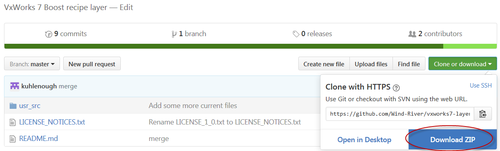
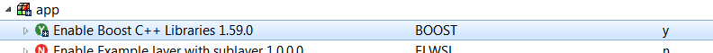
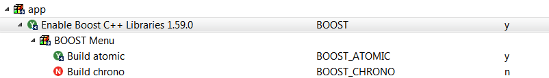

## VxWorks&reg; 7 Recipe Layer for Boost

This repository contains a VxWorks&reg; 7 Source Build (VSB) layer. 
Add this layer to your VxWorks install to build and verify the Boost C++ Libraries (_Boost_)
as part of your board's VSB project.  

This repository contains a collection of patches to adapt the Boost C++ libraries (at version 1.59.0)
to VxWorks.  Boost consists of many libraries, and not all of them will work with VxWorks. Some of
them require C++ support not available in VxWorks, or are dependent on other libraries not available 
for VxWorks. The **vxworks7-boost** project goal is to validate as many Boost libraries as possible
and then push the required changes to boost.org. Until the patches are incorporated into Boost
they will exist here.

This layer does not contain Boost; it only provides a recipe to adapt Boost to VxWorks. 
Boost is not part of any VxWorks product, and is not covered by your Wind River support agreement.
If you need help, use the resources available and boost.org, or contact your Wind River sales
representative to arrange for consulting services.

## Project License

The source code for this project is provided under the Boost Software License - Version 1.0 (BSL-1.0). Text for the BSL-1.0 and other applicable license notices can be found in the LICENSE_NOTICES.txt file in the project top level directory. Different files may be under different licenses. Each source file should include a license notice that designates the licensing terms for the respective file.

## Prerequisite(s)

Install the Wind River&reg; VxWorks&reg; 7 operating system from March 2017 or later.
The Boost layer has a dependency on the UNIX compatibility layer in this release;
***InstallDir*/vxworks-7/pkgs/os/utils/unix** 

If you are on a system **without internet conectivity**, you must obtain the Boost sources and put them in: ***InstallDir*/vxworks-7/download**. On a Linux build host, obtain these sources from http://sourceforge.net/projects/boost/files/boost/1.59.0/boost_1_59_0.tar.gz/download, and on Windows from http://sourceforge.net/projects/boost/files/boost/1.59.0/boost_1_59_0.zip/download. If you are online, these are downloaded by **wget** or **curl** during the build. 


## Installation

1. Obtain the VxWorks Boost layer:
  *  Go to  https://github.com/Wind-River/vxworks7-layer-for-boost
  *  Download a zip of the layer using the link provided by GitHub.
	 
  *	Unzip into your VxWorks install directory in an appropriate place in the packages directory, typically;
      ***InstallDir*/vxworks-7/pkgs/app**
	  
2. If you are using the Boost **streams** library you must obtain the **bzip2** layer and place it in your VxWorks 7 install in a similar manner: https://github.com/Wind-River/vxworks7-layer-for-bzip2 	  

## VxWorks Configuration and Build

Create a VSB project based on your BSP, with Workbench or from the command line. For example, on Linux: 	  

```
$ cd InstallDir
$ ./wrenv.linux –p vxworks-7
$ cd ../workspace
$ export WIND_WRTOOL_WORKSPACE=`pwd`
$ wrtool prj vsb create –bsp vxsim_linux simVSB
$ cd simVSB  
```

Or, on Windows:

```
$ cd InstallDir
$ wrenv -p vxworks-7
$ cd workspace
$ set WIND_WRTOOL_WORKSPACE=%cd%
$ wrtool prj vsb create –bsp vxsim_windows simVSB
$ cd simVSB
```

After creating the VSB (VxWorks source build project), include the BOOST layer using the Workbench configuration editor:


The VSB build unpacks Boost into ***vsbDir*/3pp/BOOST**, and copies the headers to ***vsbDir*/usr/h/public/boost**.
The buildable portions of Boost become visible selections in the Workbench configuration menu once the layer is enabled. 


Only the Boost system library is included by default. Boost is primarily a set of C++ template header libraries.  While some of the Boost modules can be used within an RTP without additional run-time support, the Boost menu components presented in the VSB configuration are those that provide pre-built run-time libraries that can be linked with an RTP. You will need to enable such components in the VSB if your RTP depends upon them. Because it is not always initially obvious which libraries are required, you may wish to enable all of the *non-TEST* Boost VSB components.

NOTE: The **BOOST_THREAD** component has an additional dependency. You must enable **DEFAULT_PTHREAD_PRIO_INHERIT** before the Boost thread library is visible in the VSB configuration editor.

You can also configure and build the VSB using the command line (in Workbench, or a separate **wrenv** shell) with **vxprj** or **wrtool**, for example:
```
$ vxprj vsb add BOOST
$ vxprj vsb config -s -add "_WRS_CONFIG_BOOST_MATH=y" \
     -add "_WRS_CONFIG_DEFAULT_THREAD_PRIO_INHERIT=y" \
     -add "_WRS_CONFIG_BOOST_THREAD=y"
$ make 
``` 
or 
```
$ wrtool prj vsb add BOOST
$ wrtool prj vsb value set BOOST_MATH y
$ make 
```

If you are using Workbench, you may want to turn off C++ indexing before you build the VSB, as the Boost libraries are large. Right-click on the VSB project name, select **Properties > C/C++ General > Indexer**, and un-check **Enable Indexer**. Click **Apply**, and **OK**.

The Makefile that actually builds the code is ***InstallDir*/vxworks-7/pkgs/app/boost/usr_src/vxworks.lib.mak**. This is copied to the Boost source directory, ***vsbDir*/3pp/BOOST/boost_1_59_0/**.

## b2 Usage
 
The initial build of the Boost layer creates the **vxworks_env.sh** which contains the current VSB cross build environment. This is propagated to the Boost jam build environment by the generic **project_config.jam** file provided in the Boost layer. Once these files are in place, you can optionally invoke the **b2** outside of the VSB build by first sourcing **vxworks_env.sh**. Duplicate the command found in the build log. For example:

```
$ cd  3pp/BOOST/boost_1_59_0
$ . ./vxworks_env.sh 
$ ./b2 install --prefix=VSBDir/usr/root --libdir=VSBDir/usr/lib/common \
--includedir=VSBDir/usr/h/public  link=static  toolset=gcc cross-compile=vxworks     \
--with-atomic --with-chrono --with-context --with-coroutine --with-exception \
--with-test -q -d2
```

To rebuild the Boost layer incrementally, you can use the following command: 
```
$ vxprj vsb build BOOST
```

## Testing 

Boost provides a set of regression tests that you can run to verify the functionality of its libraries on VxWorks. The tests can be built (and optionally run) as part of the VSB build, or the tests can be built and run separately.

To enable building the tests as part of the VSB build, enable the **BOOST_TEST** component, and any specific regression test components that you wish. All regression tests are dependent on the test harness library therefore it must be included first. For example:
``` 
$ vxprj vsb config -s -add "_WRS_CONFIG_BOOST_TESTS=y"
$ vxprj vsb config -s -add "_WRS_CONFIG_BOOST_MATH_TESTS=y"
```
The default behavior is to simply build the tests during the final VSB build stage.
To actually execute the tests after each one is built, specify the telnet address of your test system.
```
$ vxprj vsb config -s -add "BOOST_TELNET_ADDR=192.168.200.1"
```
The target's path to the workspace defaults to using the TCF path, but you can set it to another method. 
```
$ vxprj vsb config -s  \
-add "_WRS_CONFIG_BOOST_HOST_FILEPATH_MAPPING_PREFIX=bkuhlfedora:"
```
The tests are executed on a Linux host by connecting to the target through telnet using an expect script found in the Boost layer: **vxworks_boost_test_run.exp**. Or, for 64-bit Windows machines, **boost_test.exe** is created from **boost_test.py**.

There is a *chicken and egg* problem here. You must create a VIP from the VSB before running the Boost tests therefore, with this method, it is necessary to build the VSB twice in order to run the tests. For example, execute the following in you workspace:

```
$ wrtool prj vsb create –bsp simVSB vxsim_linux
$ cd simVSB  
$ vxprj vsb add BOOST
$ vxprj vsb config -s -add "_WRS_CONFIG_BOOST_MATH=y"
$ make 
$ cd ..
$ wrtool prj vip create –vsb simVSB vxsim_linux gnu simVIP
$ cd simVIP 
$ vxprj component add INCLUDE_IPTELNETS
$ vxprj component add INCLUDE_PX_SCHED_DEF_POLICIES
$ vxprj component add 
$ vxprj build
$ sudo ../../wrenv.linux -p vxworks-7
> vxsimnetd –sv &
> exit
$ gnome-terminal -e "vxsim -netif simnet0=192.168.200.1 -f default/vxWorks"
$ cd .. 

$ cd simVSB  
$ vxprj vsb config -s -add "_WRS_CONFIG_BOOST_TESTS=y"
$ vxprj vsb config -s -add "_WRS_CONFIG_BOOST_MATH_TESTS=y"
$ vxprj vsb config -s -add "_WRS_CONFIG_BOOST_TELNET_ADDR=192.168.200.1"
$ vxprj vsb config -s -add  \
"_WRS_CONFIG_BOOST_HOST_FILEPATH_MAPPING_PREFIX=bkuhlfedora:"
$ make
```

**NOTE:** If you are running Windows, in the above commands, replace `wrenv.linux` with `wrenv` and `vxsim_linux` with `vxsim_windows`.

Test pass/failure results appear on the console; the results are also stored in the Boost build directory in 
***vsbDir*/3pp/BOOST/boost_1_59_0/bin.v2/libs/*library_name***.

### Testing with build_run_tests.sh
As an alternative to running the Boost test harness within the VxWorks VSB build, a bash shell script **build_run_tests.sh** is generated by the build that can be invoked independently once the Boost layer is built. For example:

```
$ wrtool prj vsb create –bsp simVSB vxsim_linux
$ cd simVSB  
$ vxprj vsb add BOOST
$ vxprj vsb config -s -add "_WRS_CONFIG_BOOST_MATH=y"
$ vxprj vsb config -s -add  \
"_WRS_CONFIG_BOOST_HOST_FILEPATH_MAPPING_PREFIX=bkuhlfedora:"
$ make 
$ cd ..
$ wrtool prj vip create –vsb simVSB vxsim_linux gnu simVIP
$ cd simVIP 
$ vxprj component add INCLUDE_IPTELNETS
$ vxprj component add INCLUDE_PX_SCHED_DEF_POLICIES
$ vxprj component add 
$ vxprj build
$ sudo ../../wrenv.linux -p vxworks-7
> vxsimnetd –sv &
> exit
$ gnome-terminal -e "vxsim -netif simnet0=192.168.200.1 -f default/vxWorks"
$ cd .. 

$ cd simVSB/3pp/BOOST/boost_1_59_0  
$ export BOOST_TELNET_ADDR=192.168.200.1"
$ ./build_run_tests.sh  --limit-tests=math
```

**NOTE:** If you are running Windows, in the above commands, replace `wrenv.linux` with `wrenv` and `vxsim_linux` with `vxsim_windows`.

You can also choose to edit the **build_run_tests.sh** script to set the host and target-relative paths and environment variables used during testing. The environment variables **LAYER_SRC_PATH** and **VSB_LD_LIBRARY_PATH** must be paths appropriate for the target (accessing the host file system); while the rest of the paths mentioned in the script are host paths. As mentioned below in the *Testing Notes* section, Wind River recommends that you configure the target so that it can access the host file system using paths identical to the host paths. If you manually edit **build_run_tests.sh**, you do not need to add the **BOOST_TESTS** component to your VSB, nor do you need to add any of the specific Boost VSB regression test components.

**build_run_tests.sh** is a wrapper of the Boost **b2** command and, by default, it tests the entire set of Boost libraries; even those that are unsupported. Therefore, the command must be invoked with options that modify the behavior for your testing requirments. For complete **b2** documentation, consult the Boost documetation at http://www.boost.org/build/doc/html/bbv2/overview/invocation.html. The following options are used by the VSB Boost layer but are not included in **build_run_tests.sh** :

| Option |   Behavior  | 
| ------ | ----------- |
| -q     |  quit after the first test failure |
| -d2    |  debug level 2, print command invocations |
| -a     |  rebuild/re-run all specified tests, even those that have already passed. |
| testing.execute=off |  build tests only, do not execute |.
| --abbreviate-paths | munge the test directory names so they are shorter |
| --limit-tests="*library1*\|*library2*" | only build and execute a subset of library tests |
| variant=release | build test executables without debug information |
| -j*Jobs* | run tests in parallel using *Jobs* threads |  

### Testing Notes:
* Some Boost tests use a parameter that is an absolute host file path. The test harness has not been modified to translate these paths to target paths. If running on a hardware (non-simulator) target, you can use the VxWorks NFS client to execute these tests. Make the client mount point identical to the exported path. On a typical Linux build host, the commands would be similar to:
```
$ sudo systemctl start nfs-server
$ exportfs -o rw,sync /home/user/WindRiver/workspace
```
And then VxWorks system's **usrAppInit()** would be similar to the following:
```
#include <nfs/nfsDriver.h>
#include <nfs/nfs3Lib.h>
#include <stdio.h>
#include <errno.h>

void usrAppInit (void)
    {
    char * nfshost = "buildhost";
    char * exportpath = "/home/user/WindRiver/workspace"; 


    (void)hostAdd ("buildhost", "10.10.157.220");

    nfsAuthUnixSet ("buildhost", 1000, 100, 0, NULL);

    /*
     * Note: using a local NFS device name equal to the exportpath
     * so that target paths can be identical to host paths.
     */
    if (OK != nfsMount (nfshost, exportpath, exportpath))
        {
        perror ("nfsMount");
        }
    }
```
**NOTE:** The local NFS device name (third argument to **nfsMount( )**) is chosen to be equal to the *exportpath* on the host so that files within the exported NFS file system are accessible on the target using the exact same absolute path as on the host.

The use of NFS may not be easily available on Windows hosts.
  
* The default command-line length of the VxWorks interpreter is not long enough to execute all tests. Increase it by modifying the VIP configuration.
```
$ vxprj parameter value SHELL_DEFAULT_CONFIG
SHELL_DEFAULT_CONFIG = "INTERPRETER=,LINE_EDIT_MODE=,LINE_LENGTH=256,STRING_FREE=manual,VXE_PATH=.;/romfs"
$ vxprj parameter setstring SHELL_DEFAULT_CONFIG 'INTERPRETER=,LINE_EDIT_MODE=,LINE_LENGTH=1024,STRING_FREE=manual,VXE_PATH=.;/romfs'
```
* The ***exceptions/copy_exception_test*** fails with the debugger attached. It launches thousands of threads and overwhelms the debugger. 
* Workbench users should disable source indexing for the VSB; otherwise, java runs out of memory. 
* The boost library core tests fail if not executed with a target IP configured. The boost test harness does not properly deal with the “run fail” targets this library uses. 
* The number of make build threads used in the VSB build is propagated to the Boost build though the -j option. However, during testing, this means multiple telnet sessions run concurrently on the target system, and can overwhelm the memory on the target system. If you have unreproducible, odd errors, or out of memory errors like the one shown below, repeat the testing single-threaded to confirm the test is not failing due to target resource limitations.
```
0x81e4b180 (iTest_random_generator): memPartAlloc: block too big 520 bytes (0x8 aligned) in partition 0xe27312a0
0x81e4b180 (iTest_random_generator): memPartAlloc: block too big 520 bytes (0x8 aligned) in partition 0xe27312a0
```

### Other Notes:
* No clean rule is provided for the Boost layer, but cleaning the VSB rebuilds Boost as well. The download directory is not touched. Therefore, the rebuild begins from the unpack stage.
* Removing the ***vsbDir*/3pp/BOOST**  directory or  ***vsbDir*/3pp/BOOST/boost_1_59_0/bin.v2/libs/*library_name*** incrementally rebuilds Boost, independent of the VSB.

## Using Boost Libraries with RTP Applications

Your VIP project (based on your VSB) does not require any special configuration with regard to Boost or standard VxWorks C++ support (which is included by default).  

For your RTP application project:

1. Create the project and base it on the VSB project.

2. Add your code to the project.
  * For example, you could use the code provided at http://www.boost.org/doc/libs/1_63_0/libs/timer/doc/cpu_timers.html.
  * Add **#include \<vxWorks.h\>** at the start of the example code.
  * Be sure your file is named with a '.cpp' extension rather than a '.c' extension!

3. Add the required library directives in the RTP project build properties. 
  *  If you are using Workbench, right-click on the application project name, then select **Properties > Build Properties > libraries**.  Add the **boost_system** and **unix** libraries for all applications, as well as any others that are specifically required for your application to build.
     For the example code mentioned above, add:
     
     ```
     -lboost_system
     -lboost_timer
     -lboost_chrono
     -lunix
     ```
     
  *  Click **Apply** and **OK**.
  
4. The Boost headers are copied into the VSB's normal include paths (at **boost/*...***). Therefore, you should not need to add any include paths specifically for Boost. However, you may need to add an include path for the *published* headers in the UNIX layer. Using Workbench, select the RTP application project name, then choose **Properties > Build Properties > Paths > Add**. Add in the following directive:
    ```
    -I$(VSB_DIR)/usr/h/published/UNIX
    ```
Click **Apply**, and **OK**.

5. You may also wish to disable C++ indexing for the RTP project. This can be done in the same way as described for the VSB project.

6. Build the RTP project.
   * When prompted to generate the include search path, click **Generate Includes**, and click through the remaining dialogs.
   * If there are any missing symbols, you may need to add additional directives for the libraries containing them.

## Porting Status 

Porting is currently focused on Intel BSP (itl_generic) using the GNU compiler with C++03 and 64-bit support selected. Other configurations are selectable, but have not been verified by Wind River.
Not all Boost tests are passing, see the [TestResults.md document](./docs/TestResults.md) for details. 

### Legal Notices

Disclaimer of Warranty / No Support: Wind River does not provide support and maintenance services for this software, under Wind River’s standard Software Support and Maintenance Agreement or otherwise. Unless required by applicable law, Wind River provides the software (and each contributor provides its contribution) on an “AS IS” BASIS, WITHOUT WARRANTIES OF ANY KIND, either express or implied, including, without limitation, any warranties of TITLE, NONINFRINGEMENT, MERCHANTABILITY, or FITNESS FOR A PARTICULAR PURPOSE. You are solely responsible for determining the appropriateness of using or redistributing the software and assume any risks associated with your exercise of permissions under the license.
